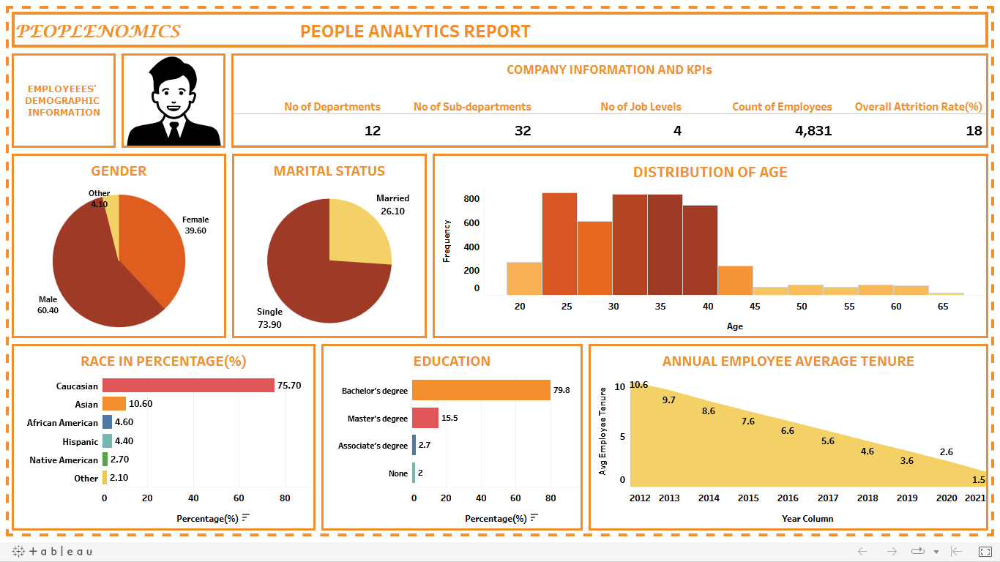
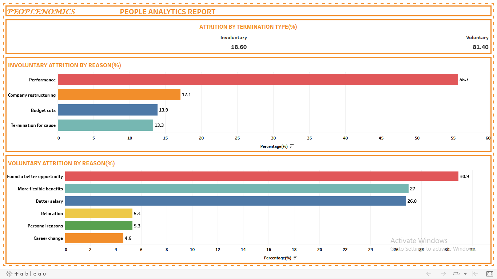
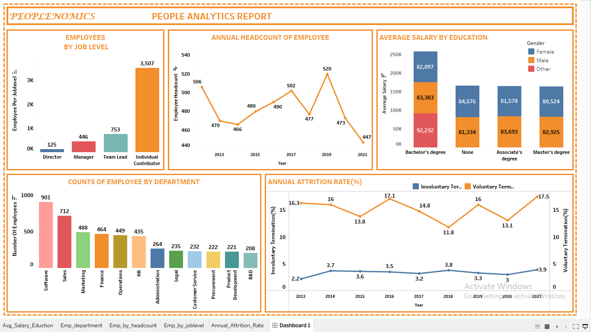

# PEOPLE_ANALYTICS_REPORT

## INTRODUCTION

According to an article titled ‘Want To Improve Decision Making? 15 Ways To Leverage People Analytics’, written by a Forbes Council Member. 
See link 
([https://www.forbes.com/sites/forbeshumanresourcescouncil/2021/07/09/want-to-improve-decision-making-15-ways-to-leverage-people-analytics/])

It was written that life is all about making decisions, either as an individual or a cooperate body. In a company’s case, the ability to make the right decision shouldn’t just be based on instinct and intuition. Rather, it should be influenced by people analytics.
Therefore, people Analytics which can also be referred to as human resource analytics, talent analytics, or workforce analytics is simply the process of collecting, analysing, and learning from a company’s employee data and using it to make informed decisions about the people, processes, and organization to improve outcomes for the people and for the business as a whole. 

People analytics can be divided into four (4) types. They include
- Descriptive Analytics: This describes what has already happened.
- Diagnostic/Insightful Analytics: This explains why something happened.
- Predictive Analytics: This uses past data (along with algorithms and statistical modelling) to predict what could happen in the future.
- Prescriptive Analytics: This makes recommendation on what a business should do next. 

This project focuses just on descriptive, diagnostic/insightful and prescriptive analytics.

## ABOUT THE DATASET

The People Analytics Starter Dataset is a free simulated dataset for a fake large software company named Peoplenomics. This dataset includes data on over 4000 employees, including their demographic information, job details, salary information, and more. The dataset includes columns for employee ID, department, sub-department, job level, managers, gender, sexual orientation, race, age, education, location, location city, marital status, employment status, salary, hire date, term date, tenure, term type, term reason, and active status.

## BUSINESS PROBLEM

There is a need for analysing trends in employee data, such as turnover rates, salary disparities, diversity and more in other to unlock insights, discover Key Performance Indicators (KPIs) and to make the company successful by making well-informed decisions.
	
Here are some the metrics to be worked upon while embarking on this project:
- Explore trends in employee turnover rates over time. This can also include calculating the annual attrition rate and visualizing the results over time to identify any patterns or spikes in turnover.
- Investigate trends in employee headcount over time. This could involve calculating the total number of employees in the organization each year, and visualizing the results to identify any changes in headcount over time.
- Examine the distribution of employee ages across the organization. This could involve creating a histogram or other visualization of the ages of all employees, and identifying any patterns or trends in the distribution.
- Explore the relationship between employee salary and various demographic factors such as gender, race, and education level. This could involve creating scatter plots or other visualizations to identify any trends or correlations between salary and these variables.

## INSIGHTS DERIVED FROM DATASET

The following are some the insight derived with the use of SQL
- Employee demographic information (This include gender, age, marital status, education, race, etc).
- Time series of Attrition rate, employee head count and employee average tenure.
- Types of Attrition (Voluntary and Involuntary) with reasons, etc.

## VISUALIZATIONS OF INSIGHTS ABOVE
	
  ### EMPLOYEE'S DEMOGRAPHIC
  
  
  
  Link to visualization above ([https://public.tableau.com/app/profile/sherif.atanda/viz/EmployeesDemInfo2/EmployeeDemographics])
    
  ### ATTRITION INFORMATION
  
  
  
  Link to visualization above ([https://public.tableau.com/app/profile/sherif.atanda/viz/Attrition_Information/Attrrition_Info])
  
  ### TREND OVER THE YEARS & OTHER INFORMATION
  
  
  
   Link to visualization above ([https://public.tableau.com/app/profile/sherif.atanda/viz/Patternandotherinfo/Dashboard1])

## IMPORTANT FINDINGS 

1.	The company comprises of mostly males. 
2.	Majority of the employees were singles.
3.	With respect to population based on race/ethnicity, the number of Caucasians were the greatest.
4.	The employees age ranges from 20 to 65. While majority of the employees are within the range of 23 to 40.
5.	In terms of educational level, about 80% of the employees are with Bachelor’s degree.
6.	Overall attrition rate (commonly referred to as Churn rate, is the rate at which people leave the company) over the years was about 18%.
7.	The education level does not really determine the salary range. Because the average salary of the bachelor’s degree holder exceeded that of both associate and       master’s degree. 
8.	The employee average tenure (length of time am employee works for an employer) reduced drastically by the year. 
9.	The company had the lowest and highest headcount in 2021 and 2019 respectively.
10.	From the about 18% attrition rate. The reason was either it being voluntary or involuntary. The percentage Voluntary and Involuntary attrition rate are 81% and       19% respectively.
11.	For those who left voluntary, the three major reasons are because they found a better opportunity, more flexible benefits and better salary.

## RECOMMENDATIONS TO SOLVE THE BUSINESS PROBLEM

1. Prioritize Employee Wellness: Knowing that employee’s attrition damages the growth of a company because a number of valuable team members are lost. Prioritizing employee wellness also ensures the workers are healthier, happier, and less likely to need extended periods of leave due to illness or stress. Mental health supports, flexible hours, and paid vacation policies are just some of the offerings that employees might find valuable, all of which will help to reduce burnout and boost productivity.
2. Conduct Employee Exit Interviews: Make sure to create a safe and open space for employees to provide feedback, and allow them to speak to an impartial member of your HR team instead of their direct manager. By gaining insights into why employees are leaving your company, you will be positioned to further improve your retention strategies.
3. Celebrate Positive Experiences: This involves celebrating employee great work, birthday, etc.
4. Comfortable Work Environment: One way to create a comfortable environment is to provide a break area with a refrigerator, coffee maker, television and table and chairs. Encourage working together as a team and act quickly to resolve employee relations problems and workers will appreciate and value their workplace.
5. Benefits: The benefits offered in a workplace can mean the difference between keeping and losing employees. Benefits that promote employee retention are a 401k plan along with child care services.
6. Providing regular opportunities for employees to provide feedback

## CONCLUSION
Having being exposed to the indispensable information locked in the dataset. It can be agreed that People analytics should become a strategy used by companies to  understand how to engage, retain and ensure the productivity of their employees. 
  Also, to make better management and business decisions. 

